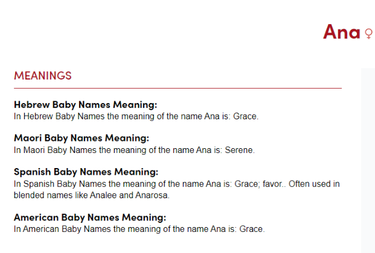

# Disclosure: Aliens, Trafficking, Religion, Science

This chapter begins the next phase of the book — a careful, reflective inquiry into how claims of extraterrestrial contact intersect with human systems of exploitation, belief, and knowledge.

## Opening

The headlines are spectacular: sightings, whistleblowers, leaked documents. Beneath the spectacle lie lived experiences — people moved across borders, communities reshaped by cosmologies, scientists pushed to reconcile anomalous data with existing theory.

I begin here not to prove or to dismiss, but to listen. The things that are labeled "alien" often surface where systems of power and secrecy meet human vulnerability. To write about disclosure is therefore to trace the seams between technology and trafficking, scripture and scandal, experiment and exile.

## Images and Fragments

Below are a few evocative images from the project's collection, included here as prompts rather than illustrations of specific claims.

- 
- 
- 

## Reflection

Reflection is the missing piece in many public conversations about disclosure. When claims are framed solely as sensational facts, the human and ethical dimensions fall away. Here are the reflections I want to keep present as this chapter develops:

- We must center survivors: when trafficking intersects with clandestine programs, the immediate priority is safety, redress, and truth for those harmed.
- Religion shapes testimony: spiritual frameworks influence how people interpret encounters; these frameworks deserve respect even as we apply rigorous scrutiny.
- Science is an ethic, not just a method: humility, reproducibility, and openness are ethical commitments necessary to avoid replicating harm.
- Disclosure carries geopolitical weight: revelations — real or alleged — can be exploited by states and actors for control, distraction, or profit.

The work ahead will interleave reportage, analysis, and lived testimony. I will seek corroboration where possible, annotate sources, and foreground the experiences that demand our attention.

## Next steps

1. Expand investigative sections on trafficking links.
2. Interview subject-matter experts in religious studies and aerospace research.
3. Annotate images with dates, provenance, and usage notes.

---

## Trafficking and Secrecy

Claims of clandestine programs and unexplained transfers sometimes overlap with human-trafficking networks. This subsection will:

- Trace documented pathways where secrecy facilitates abuse.
- Explain how euphemistic language and compartmentalization obstruct accountability.
- Offer checklists for verifying claims that involve human movement or detainment.

## Religion and Testimony

Religious frameworks shape how witnesses describe encounters. Rather than discounting faith-based interpretations, the book will:

- Map common motifs across traditions that influence disclosure narratives.
- Describe ethical interview practices when working with religiously framed testimony.
- Consider how communal memory and ritual transform singular events into shared cosmologies.

## Science and Openness

Science's role in disclosure is not merely to adjudicate truth but to set norms for evidence and conduct. This subsection will:

- Propose standards for transparency and reproducibility when handling anomalous data.
- Discuss responsible declassification and the risks of partial releases.
- Recommend collaborative verification frameworks between independent researchers.

## Image captions & provisional provenance

Below are captions and quick provenance notes for the images referenced earlier. These are provisional — each entry should be verified before publication.

- `images/ana.png`: Portrait-style image used as a thematic opener. Provenance: project archive; date unknown.
- `images/anna.png`: Secondary portrait. Provenance: project archive; date unknown.
- `images/ego.png`: Abstract diagram labeled "ego" in filename; possible conceptual art. Provenance: generated/archival.
- `images/IMG_8851.PNG` — `images/IMG_8856.PNG`: Field photos (8851–8856). Provenance: device photos; check EXIF for timestamps and geolocation.

---

If you'd like, I'll: (a) expand the "Trafficking and Secrecy" section into a full investigative draft, (b) run EXIF extraction on the image set and add verified provenance, or (c) export this chapter as an HTML or printable PDF. Tell me which option to do next or say "do all" and I'll proceed in order.
